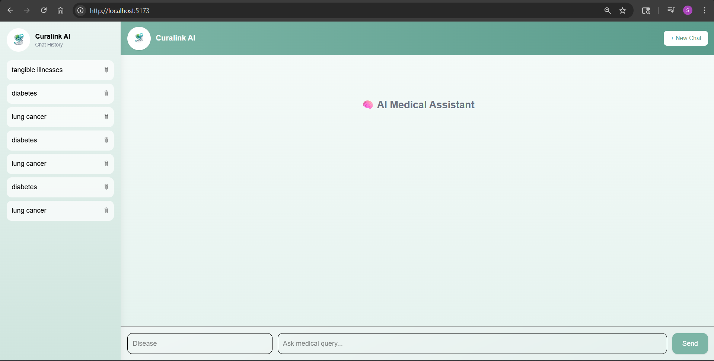
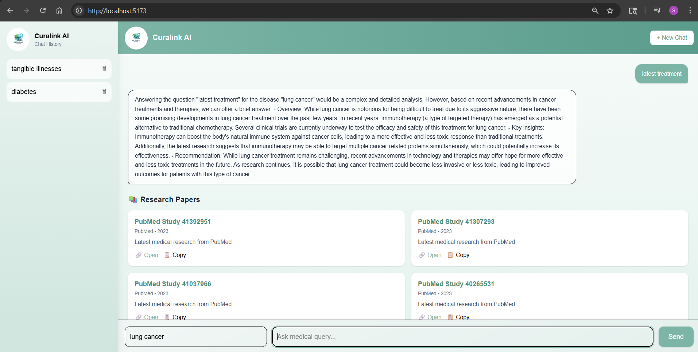
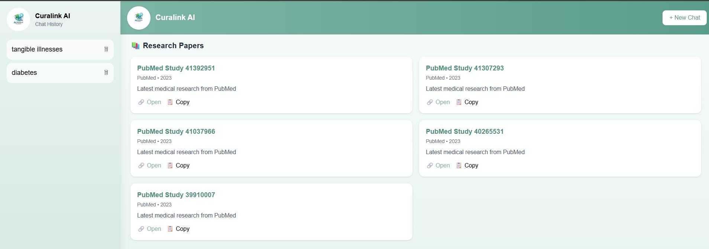
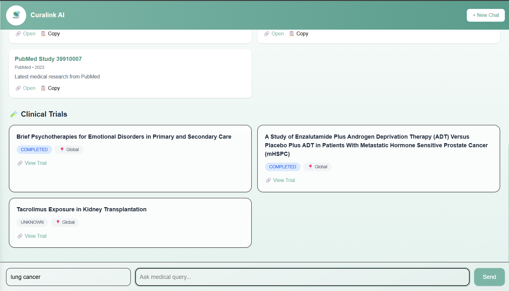
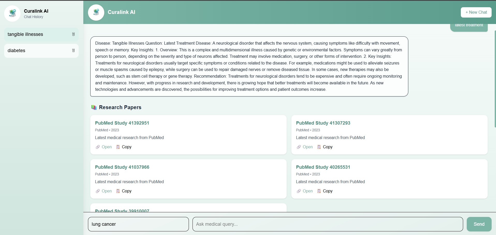
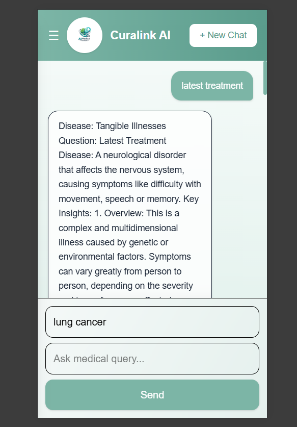

# 🧠 Curalink AI – Medical Research Assistant

Curalink AI is a full-stack AI-powered web application that helps users explore **medical research papers, clinical trials, and AI-generated insights** based on a disease and query.

It combines **React, Node.js, FastAPI, MongoDB, and AI models** to deliver a ChatGPT-like experience for medical research.

---

## 🚀 Features

### 💬 AI Chat Interface
- Ask medical queries based on disease
- Real-time **streaming responses**
- ChatGPT-style UI with typing indicator

### 📂 Chat History
- Saves conversations in MongoDB
- Load previous chats from sidebar
- Delete chats
- Active chat highlighting

### 📚 Research Papers
- Integrated with:
  - PubMed API
  - OpenAlex API
- Displays:
  - Title
  - Source
  - Year
  - Direct link to paper

### 🧪 Clinical Trials
- Fetches real trial data
- Shows:
  - Title
  - Status (🟢 Recruiting, 🔴 Terminated, etc.)
  - Location
  - Direct link

### 🎨 Premium UI
- Glassmorphism design
- Gradient theme (#7CB5A6)
- Responsive (mobile + desktop)
- Smooth animations & hover effects

---

## 🛠️ Tech Stack

### Frontend
- React.js
- Tailwind CSS
- Vite

### Backend (Main API)
- Node.js
- Express.js
- MongoDB (Mongoose)

### AI Service
- FastAPI (Python)
- Ollama (TinyLlama model)

### APIs Used
- PubMed API
- OpenAlex API
- ClinicalTrials.gov API

---

## 📁 Project Structure
curalink-ai/
│
├── client/ # React Frontend
├── server/ # Node.js Backend
├── ai-service/ # FastAPI AI Service
├── README.md
└── .gitignore


---

## ⚙️ Installation & Setup

### 1️⃣ Clone Repository
```bash
git clone https://github.com/digi2025new/curalink-ai.git
cd curalink-ai

Setup Frontend
cd client
npm install
npm run dev

Setup Backend (Node)
cd server
npm install
npm run dev

Setup AI Service (FastAPI)
cd ai-service
python -m venv venv
venv\Scripts\activate   # Windows
pip install -r requirements.txt
python -m uvicorn main:app --reload


🌐 API Endpoints
Node Backend
GET /api/chat → Get all chats
GET /api/chat/:id → Get single chat
POST /api/chat → Create chat
DELETE /api/chat/:id → Delete chat
FastAPI
POST /process → Full response (AI + research + trials)
POST /stream → Streaming AI response

## 📸 Screenshots

### 🏠 Home


### 💬 Chat


### 📚 Research


### 🧪 Clinical Trials


### 📂 Sidebar


### 📱 Mobile View


🚀 Future Improvements
🔐 User authentication (login/signup)
🌙 Dark mode
🔍 Search & filter chats
📊 Research filtering & sorting
📤 Export chat as PDF
🔊 Text-to-speech
☁️ Full deployment (Vercel + Render)


⚠️ Disclaimer

This application is for educational and research purposes only.
It does not provide medical advice. Always consult a healthcare professional.

👨‍💻 Author

Suraj Golambade
⭐ If you like this project

Give it a ⭐ on GitHub!
